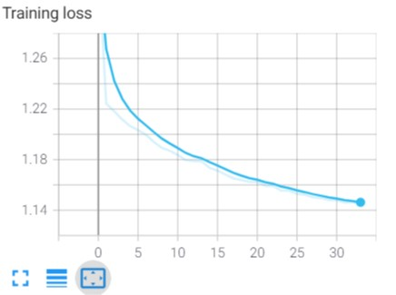
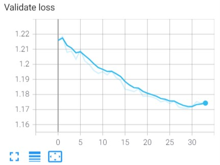

# UNet
UNet autoencoder for image segmentation on Pascal VOC 2012 Dataset

## Usage
### Install requirements
```
pip install -r requirements
```
### Download dataset
```
python download_dataset.py
```
### run training
```
python train.py
```
or
```
python train.py -lr 0.001 -p 5 -r 1e-6
```
for list of flags:
```
python train.py -h
```
## Current Results





## Citation
@misc{pascal-voc-2012,
	author = "Everingham, M. and Van~Gool, L. and Williams, C. K. I. and Winn, J. and Zisserman, A.",
	title = "The {PASCAL} {V}isual {O}bject {C}lasses {C}hallenge 2012 {(VOC2012)} {R}esults",
	howpublished = "http://www.pascal-network.org/challenges/VOC/voc2012/workshop/index.html"}


@misc{ronneberger2015unet,
      title={U-Net: Convolutional Networks for Biomedical Image Segmentation}, 
      author={Olaf Ronneberger and Philipp Fischer and Thomas Brox},
      year={2015},
      eprint={1505.04597},
      archivePrefix={arXiv},
      primaryClass={cs.CV}
}
